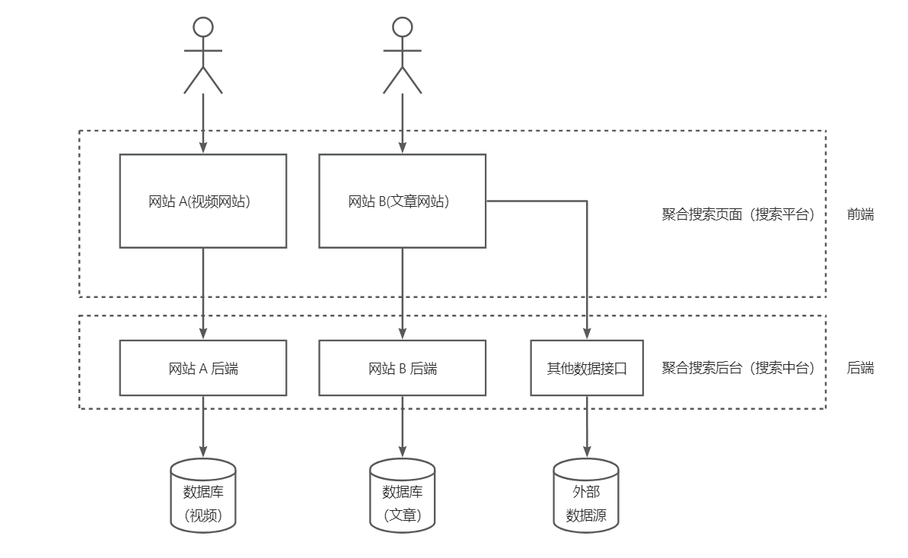

# 聚合搜素平台 - 后端 by WSJ

## 一、项目介绍

基于Vue3 + Spring Boot + Elastic Stack 的一站式聚合搜索平台，用户可以在同一页面集中搜索不同来源、不同内容的数据，提升用户的 检索效率和搜索体验。

## 二、项目架构

## 三、技术栈

- Spring Boot
- MySQL
- Elasticsearch 搜索引擎
- 数据抓取
  - 离线
  - 实时
- 数据同步
    - 定时
    - Canal

## 四、简介

1. 基于自己二次开发的 Spring Boot 初始化模板 + MyBatis X 插件，快速生成基本数据源的增删改查（比如用户、文章）。
2. 数据源获取：
   - 使用 HttpClient 请求 离线 获取外部网站的文章，并使用 Hutool 的 JSONUtil 解析和预处理文章，最终入库。
   - 使用 jsoup 实时 请求 bing 搜索接口获取图片，并使用 CSS Selector 语法解析和预处理图片信息，最终返回给前端。
3. 为实现多类数据源的整体搜索，使用门面模式在后端对各类数据源的搜索结果进行聚合，统一返回给前端，减少了前端请求次数（N 次到 1 次）以及前端开发复杂度。并通过 CompletableFuture 并发搜索各数据源进一步提升搜索接口性能。
4. 为提高聚合搜索接口的通用性，首先通过定义数据源接口来实现统一的数据源接入标准；当新数据源要接入时，只需使用适配器模式对其数据查询接口进行封装、以适配数据源接口，无须修改原有代码，提高了系统的可扩展性。
5. 为减少代码的圈复杂度，使用注册器模式代替 if else 来管理多个数据源对象，调用方可根据名称轻松获取对象。
6. 为解决文章搜不出的问题，自主搭建 Elasticsearch 来代替 MySQL 的模糊查询，并通过为索引绑定 ik 分词器实现了更灵活的分词搜索。
7. 构建 ES 文章索引时，采用动静分离的策略，只在 ES 中存储要检索的、修改不频繁字段（比如文章）用于检索，而修改频繁的字段（比如点赞数）从数据库中关联查出，从而减少了 ES 数据更新和同步的成本、保证数据一致性。
8. 为了更方便地管理 Elasticsearch 中的数据，自主搭建 Kibana 并配置 index pattern 和看板，实现对文章数据的可视化管理。
9. 开发搜索功能时，使用 Kibana DevTools + DSL 调试 ES 的搜索效果，并使用 Spring Data Elasticsearch 的 QueryBuilder 组合查询条件，实现对 ES 内文章的灵活查询（比如查询同时查询标题和文章中带有指定关键字的内容）。
10. 使用 Spring Scheduler 定时同步近 5 分钟内发生更新的 MySQL 的文章数据到 ES，通过唯一 id 来保证每条数据同步的准确性。
11. 可以使用 Canal 监听 MySQL，并将数据实时同步到 Elasticsearch
12. 使用 Knife4j + Swagger 自动生成后端接口文档，并通过编写 ApiOperation 等注解补充接口注释，避免了人工编写维护文档的麻烦。

## 五、运行展示

从`ElasticSearch`中搜索数据：

使用`Jsoup`实时从`https://www.bing.com/images`中搜索图片：

使用`HttpRequest`实时从`https://www.bilibili.com`中搜索视频：

